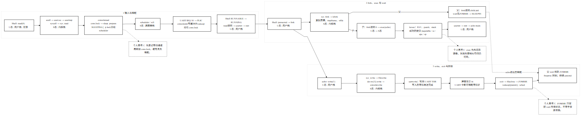
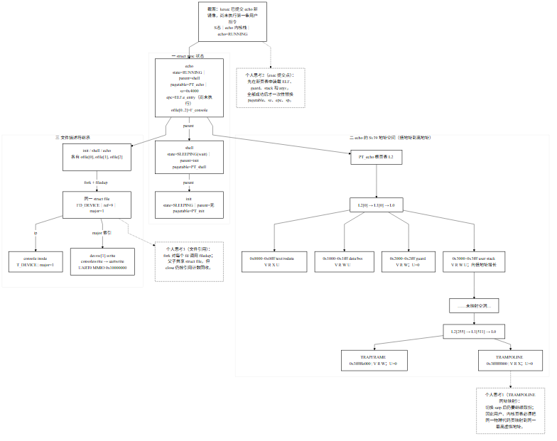
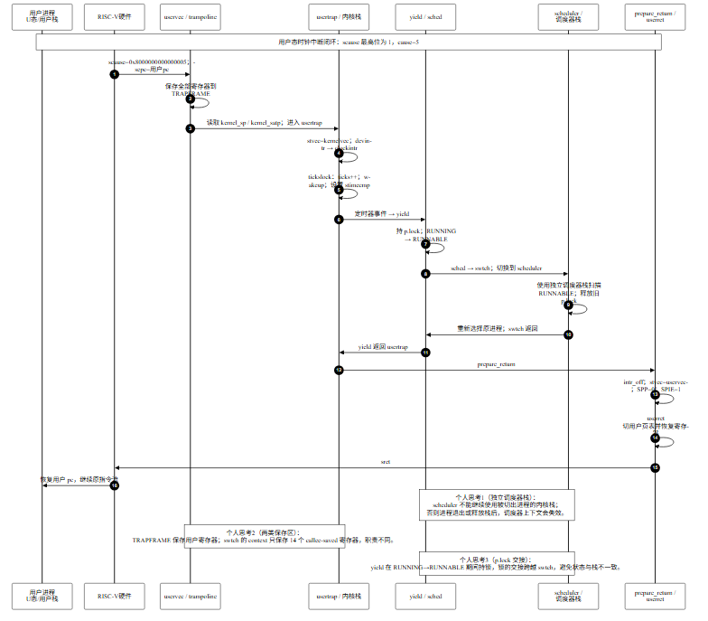
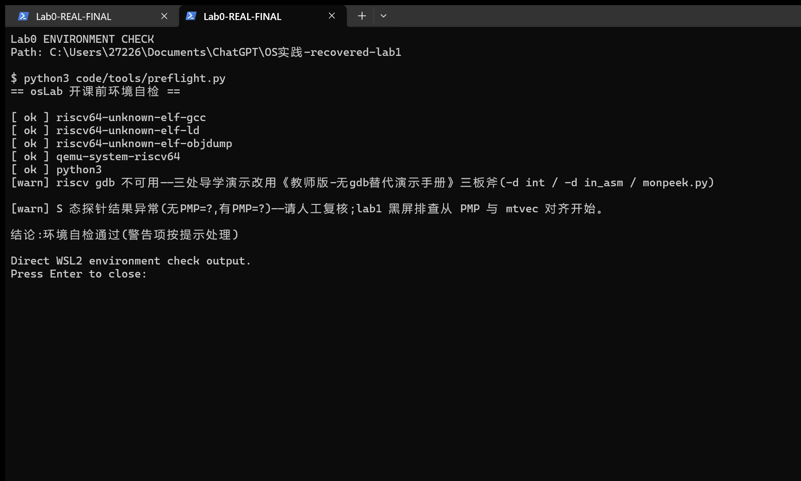

# Lab0 实验记录：源码阅读与机制追踪

## 1. 任务与交付

Lab0 按 V2 说明书完成课程 xv6-riscv 源码阅读，不新增内核代码。工作集中于 `echo hi` 的进程生命周期、`exec` 地址空间截面、时钟中断调度闭环，以及环境和图纸自检。新版要求与路径逐项对照见 [`lab0-v2-requirements.md`](../../../course-config/lab0-v2-requirements.md)。

| 要求 | 本仓库对应成果 | 核对重点 |
|---|---|---|
| `echo hi` 完整控制流 | [图 1](../images/01-echo-control-flow.png) | 键盘输入、Shell `read` 阻塞、UART 中断唤醒、`fork/exec/write/exit/wait` 和提示符恢复；标明 U/S 态、三类栈与切换原因 |
| `exec` 时状态快照 | [图 2](../images/02-exec-state-snapshot.png) | `init/shell/echo` 状态与父子关系、`sz`、`epc=ELF.e_entry`、Sv39 地址空间、空洞、PTE 权限、guard、用户栈、`TRAPFRAME`、`TRAMPOLINE` 和 `ofile[0..2]` |
| 时钟中断和上下文切换 | [图 3](../images/03-timer-interrupt-journey.png) | `scause=0x8000000000000005` 至 `uservec/usertrap/yield/swtch/scheduler/prepare_return/userret/sret` 的闭环；区分 trapframe 与 context，并说明 `p->lock` 交接 |
| 自主分析及可复绘 | 三图各有至少三处个人思考批注；PNG 为展示图，同名 `.mmd` 为源文件 | 黑白图形；分析涵盖 fork 双返回、阻塞唤醒、exec 提交、TRAMPOLINE 同址映射、独立调度器栈等 |

## 2. 完成的源码分析

| 阶段 | 分析结论 |
|---|---|
| 输入与唤醒 | Shell 经 `read(0)` 进入 `consoleread`；无完整输入时先登记 `&cons.r` 等待通道，再释放 `cons.lock` 并睡眠。UART 外部中断经 PLIC、`uartintr`、`consoleintr` 写入环形缓冲；输入满足条件后 `wakeup(&cons.r)`，Shell 被重新调度并从 `read` 返回。 |
| `fork` 与 `exec` | `fork` 复制页表和 trapframe；父进程收到子 PID，子 trapframe 的 `a0=0`。echo 的 `kexec` 先创建新页表、装入 ELF 和参数，成功后才提交新映像，因此失败不会先破坏旧映像。 |
| `exec` 截面 | 图中截面为新映像已提交、尚未执行首条用户指令：echo 在 S 态、状态 RUNNING，`sz=0x4000`，`epc=ELF.e_entry`。按课程参考 `_echo` 分析，低地址含 text/rodata、data/BSS、无 `PTE_U` 的 guard 和用户栈；高地址映射 `TRAPFRAME`、`TRAMPOLINE`，两者不授予用户访问权限。图示 ELF 地址与权限是源码/课程参考二进制分析值，不是本仓库内核实测值。 |
| 输出、退出与回收 | `write(1,...)` 经 `sys_write → filewrite → consolewrite → uartwrite` 输出；`exit` 关闭文件引用并将进程置为 ZOMBIE、唤醒父进程；父进程 `wait` 后回收进程槽、trapframe、页表和用户页，Shell 返回命令循环。 |
| 时钟中断与调度 | 用户态时钟中断进入 trampoline，硬件写入陷入 CSR，汇编保存用户寄存器至 `TRAPFRAME`；`usertrap` 分发时钟事件并可 `yield`。`swtch` 仅保存内核 context 中需跨调用保留的 callee-saved 寄存器，切换到独立调度器栈；重新选中进程后经 `prepare_return/userret/sret` 恢复用户态。 `yield` 与 scheduler 在切换期间交接 `p->lock`，保护进程状态和栈的转换。 |

以上为对课程参考源码与实验图的静态追踪说明，不表示本仓库内核实现了 Lab0 场景。逐函数阅读和现场自查的核心结论集中在本报告；教师查阅本报告与三张图即可。

## 3. 结果、证据与验证边界

| 证据 | 可以证明 | 不能据此声称 |
|---|---|---|
| [环境预检终端截图](../images/lab0-terminal-run.png) | 真实 WSL2 `preflight.py` 检查识别到 RISC-V GCC/LD/objdump、QEMU 和 Python；GDB 缺失、S 态探针异常按课程说明分别改用替代调试和人工复核，结论为环境检查通过。历史文字记录日期为 2026-09-07，环境为 Windows 11 + WSL2/Ubuntu 24.04.3、WSL 内核 `6.6.87.2-microsoft-standard-WSL2`、QEMU 8.2.2、Git 2.43.0、Python 3.12.3、Make 4.3、RISC-V GCC 13.2.0-11ubuntu1+12、binutils 2.42-1ubuntu1+6。 | 不是 xv6 `echo hi`、`-d int` 或时钟抢占截图；版本是历史值，不代表当前环境重新测量。 |
| 历史 QEMU/Monitor 记录 | 环境记录曾保存课程参考 xv6 启动到 `$` 的文字输出，以及 `monpeek.py` 读数：`pc=0x80000882`、`stvec=0x80005460`、`satp=0x8000000000087fff`、`scause=0`。非零 `satp` 且模式字段为 8，对应 Sv39。 | 当前环境的重新测量；仓库未保留对应原始 QEMU/Monitor 日志文件，故只作为历史文字记录。 |
| 当前资产自动化核验 | 本次 `test_lab0_artifacts.py` 定向测试 6 项通过；旧记录曾记一次包含其他检查在内的 9 项测试通过。 | xv6 运行行为或真实硬件中断轨迹。 |
| 三张黑白机制图及 Mermaid 源 | 图中机制路径、结构标注和个人分析内容；可从源文件复绘。 | 由模拟图形替代的运行证据。 |

按课程竞赛认定，Lab 验证环节可免除；本项因此以源码阅读、图纸和环境预检留痕为交付，不补造 xv6 日志。历史文字另记录课程参考内核在单核 QEMU 下启动到 Shell，以及 Monitor 寄存器读数；没有保留对应原始日志，故不把它表述为当前复测或完整 `echo hi` 现场跟踪。

## 4. 现场自查要点

以下是阅读笔记中适合口头查验的关键结论：

- **fork 如何出现两个返回值？** 父子进程从同一条 `ecall` 后继续；父进程得到子 PID，子进程因 trapframe 的 `a0=0` 得到 0。
- **exec 失败时如何保留旧程序？** 先在独立新页表加载 ELF、guard、stack 和 argv；全部成功后再提交新 `pagetable/sz/epc/sp`，然后释放旧映像。PID、父进程、打开文件和 cwd 保持不变。
- **为何 trampoline 固定映射且所有进程共用？** 切换 `satp` 的瞬间仍须能从同一虚拟地址继续取指，因此内核与用户页表把同一物理代码页映射在固定高地址；它是可执行代码，用户不可访问也不可改写。
- **Shell 在 `read` 返回前的状态及唤醒者？** 无完整输入时 Shell 为 SLEEPING、通道 `&cons.r`；UART 接收路径在换行、EOF 或缓冲区满时唤醒。
- **write 如何到 UART？** `sys_write → filewrite → devsw[CONSOLE].write → consolewrite → uartwrite`，驱动轮询发送状态后写 THR。
- **若没有首个用户进程？** scheduler 找不到 RUNNABLE 进程，单核进入 `wfi`；不会出现 init、Shell 或 `$`。
- **exit 后父进程尚未 wait？** 子进程保持 ZOMBIE；可释放的资源已关闭，进程槽、PID 与退出状态留到父进程 wait 回收。
- **fork/exit 如何避免文件描述符过早关闭或泄漏？** fork 对继承的 fd 调用 `filedup`；exit 对每个 fd `fileclose` 并清槽，引用归零才释放共享文件对象。
- **关键锁保护什么？** `cons.lock` 保护控制台输入队列，睡眠前先登记通道；`p->lock` 跨 `swtch` 交接以维护进程状态；`wait_lock` 保护父子退出/等待协调；`tickslock` 保护时钟计数；UART `tx_lock` 串行化可能睡眠的发送者。

**文档收拢说明。** 本目录只保留本报告一份说明文档。旧版结果摘要、环境记录、自动化检查输出与长篇阅读笔记已按有用事实和结论吸收到本报告；原始历史终端截图、三张 PNG 和 Mermaid 源仍保存在 `images/`。原始 QEMU/Monitor 日志并不存在，报告只保留历史文字的明确标注。

## 5. 复核命令与归档

复核命令（从仓库根目录运行）：

```bash
python3 code/tools/preflight.py
python3 -m unittest discover -s code/tests -p "test_lab0_artifacts.py" -v
```

`lab0` 是历史归档标签；本次文档整理不改代码、标签或远端状态。

## 6. 图示与截图

**图 1｜`echo hi` 控制流。** 从键盘输入、Shell 阻塞唤醒，经父子分支和 UART 输出，到 `wait` 回收并回到下一提示符。



**图 2｜`exec` 状态快照。** 展示 echo 进程、父子关系、用户虚拟地址空间、文件描述符继承和 `exec` 提交时点。



**图 3｜用户态时钟中断与上下文切换。** 展示从 `scause`、trapframe 保存、调度器栈切换到 `sret` 返回的闭环。



**图 4｜真实环境预检终端。** 可见工具探测结果及课程允许的替代调试/人工复核警告；该图只作环境检查证据。


