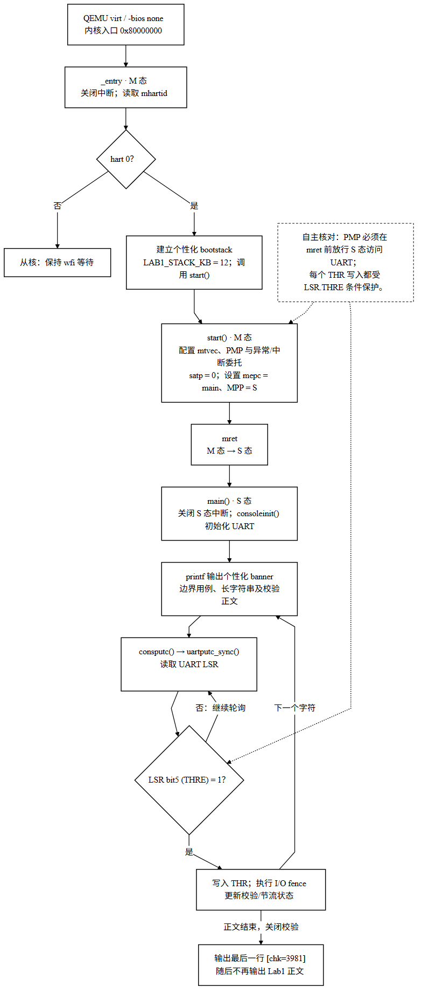
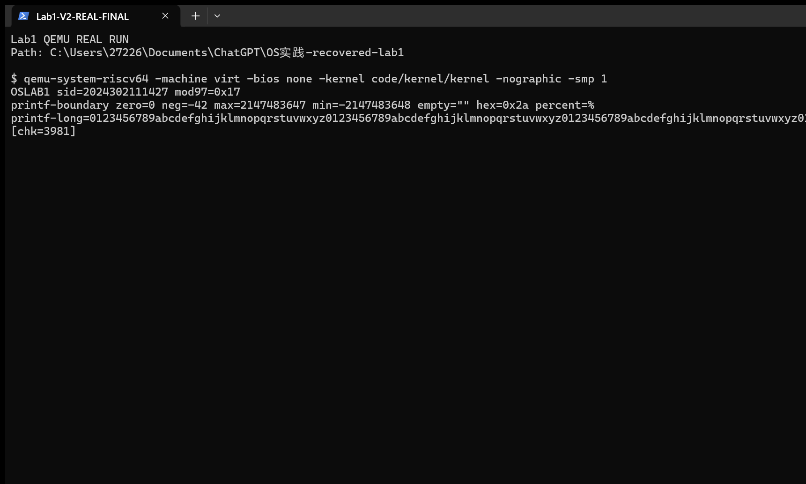

# Lab1 实验报告：启动链路与串口输出

学号：`2024302111427`　　验收环境：QEMU `virt`，单核 `-smp 1`　　依据：Lab1 学生版 V2

## 一、实验要求

本实验要求从复位入口建立最小启动环境，在机器态完成权限与陷阱委托配置，降权进入监管态；随后初始化 UART，以轮询方式稳定输出个性化信息，并实现无 libc 的 `printf` 与边界自检。

| 验收点 | 本项目实现 |
|---|---|
| 链接与启动 | 内核链接/加载基址为 `0x80000000`；`_entry` 关闭 M 态中断、只让 hart 0 继续，并使用由 `LAB1_STACK_KB=12` 定义的 16 字节对齐启动栈。 |
| M 态到 S 态 | `start()` 配置 `mtvec`、PMP、`medeleg/mideleg`、`mie/sie`、`satp=0`、`mepc=main` 及 `mstatus.MPP=S`，随后 `mret`。 |
| UART 输出 | `main()` 在 S 态初始化控制台；`uartputc_sync()` 写 THR 前轮询 LSR 的 THRE bit5；`consputc()` 作为统一字符输出入口。QEMU `virt` UART 基址为 `0x10000000`。 |
| 格式与个性化 | `printf` 支持 `%d/%s/%x/%%`；`%x` 使用小写 `0x` 前缀。学号协议 2 输出十进制学号、`sid % 97 = 0x17`，并以数字校验和作为最后一行。 |

## 二、实现内容

| 阶段 | 实现说明 | 主要代码 |
|---|---|---|
| 入口与栈 | `_entry` 读取 `mhartid`，挂起非主核，设置个性化启动栈后调用 `start()`。 | [`entry.S`](../../../code/kernel/entry.S)、[`course_sid.h`](../../../code/kernel/course_sid.h) |
| 特权级切换 | M 态授予 S 态访问权限、设置委托和返回现场；`mret` 使执行流进入 S 态 `main()`。 | [`start.c`](../../../code/kernel/start.c)、[`kernel.ld`](../../../code/kernel/kernel.ld) |
| 控制台与串口 | 初始化 16550 UART 的 8N1/FIFO 配置；通过 LSR THRE 轮询保证逐字节发送。 | [`console.c`](../../../code/kernel/console.c)、[`main.c`](../../../code/kernel/main.c) |
| 格式化与校验 | 实现整数、字符串、十六进制及百分号格式；输出边界行、长字符串和协议校验和。 | [`printf.c`](../../../code/kernel/printf.c)、[`main.c`](../../../code/kernel/main.c) |

关键实现取舍：PMP 使用 NAPOT 配置（`pmpaddr0=0x3fffffffffffff`、`pmpcfg0=0x0f`）开放物理地址访问，使 S 态代码可访问内核与 UART MMIO；本轮不启用分页（`satp=0`）。UART 关闭中断，采用 8N1、清 FIFO，并在每次写 THR 前等待 LSR bit5；发送寄存器写后执行 I/O fence。`printf` 另外支持 `%c/%u/%p` 与 `l` 修饰，对 `INT64_MIN` 避免取反溢出、空指针字符串输出 `(null)`，未知格式按原样输出，便于定位格式错误。校验范围是 banner、自测正文和换行的 ASCII 字节和对 10000 取模；停止累加后才输出 `[chk=3981]`，因此校验行本身不计入校验值。输出节流参数按学号派生，本学号对应每 19 字节执行 4 个 `nop`。

启动过程概览如下。图为源码对应关系示意，运行现象以随后真实 QEMU 截图和回归输出为准。



## 三、结果与自测

### 实际输出

```text
OSLAB1 sid=2024302111427 mod97=0x17
printf-boundary zero=0 neg=-42 max=2147483647 min=-2147483648 empty="" hex=0x2a percent=%
printf-long=0123456789abcdefghijklmnopqrstuvwxyz0123456789abcdefghijklmnopqrstuvwxyz0123456789abcdefghijklmnopqrstuvwxyz0123456789abcdefghijklmnopqrstuvwxyz
[chk=3981]
```

| 检查 | 覆盖内容 | 本次结果 |
|---|---|---|
| 输出边界 | `0`、`-42`、32 位最大/最小整数、空字符串、小写十六进制、`%%` | 期望输出形状检查通过。 |
| 连续长输出 | 连续四段数字/小写字母字符串；检查节流边界与校验和位置 | 输出末行校验和为 `3981`；实测字节流与期望文件一致，共 294 字节。 |
| 冷启动一致性 | 连续启动两次并比较 Lab1 输出前缀 | 两次一致。当前集成镜像在该前缀后可继续显示 Lab2 的 `sh> ` 提示符。 |
| 陷阱日志 | QEMU `-d int` | 当前集成镜像日志仅含已知后续实验陷阱；Lab1 回归脚本检查异常项并通过。 |
| 自动化测试 | 课程资产、Lab1 边界与启动不变式、Lab2 资产/接口检查 | `unittest` 共 13 项，全部通过。 |

个人自测覆盖两类：① 格式边界用例集中检查 0、负数、最大/最小 32 位整数、空字符串、`0x` 前缀和 `%%`；② 长字符串连续输出并重复冷启动，检查节流边界、最终校验和以及字节流确定性。

执行过的核验命令（仓库根目录）：

```bash
make -C code
python3 code/check_expect.py 2024302111427 code/expect_banner.txt
python3 -m unittest discover -s code/tests -p "test_*.py" -v
python3 code/tests/verify_lab1_qemu.py
```

本轮最终复核中构建目标已是最新；格式检查通过，13 项测试全部通过。回归脚本实际运行 QEMU 两次冷启动并进行了 `-d int` 检查，确认 UART 前缀为 294 字节且一致。该回归是在已合并后续 Lab2 代码的工作树中执行：脚本要求 Lab1 输出严格匹配期望字节前缀，并只允许后接 `sh> `；陷阱日志只允许已知的后续实验陷阱。下图是原始真实终端截图，未裁切或改写；其中 `printf-long` 单行超出终端可视宽度，行尾在画面中不可见。本次未通过 UI 重新截取，故保留原图，并以正文输出和 294 字节 QEMU 回归结果核验完整内容，不把截图表述为完整展示。



## 四、归档与查阅

| 项目 | 记录 |
|---|---|
| 提交标签 | `lab1`、`lab1-submit` 均指向 `2556770591c62a51a03f38d1a40ed21daa64c673`；远端标签对象与本地一致。 |
| 当前分支 | `main` 已包含后续实验，指向 `4570450787ca07c67a96f6074aefe8ee18cfc0fd`；这是后续提交，不代表 Lab1 标签发生变化。 |
| 提交包 | 仓库根目录的 `提交-lab1-2024302111427.zip`，由验收标签生成，不纳入源码提交。 |
| 复核归档 | `git archive --format=zip -o 提交-lab1-2024302111427.zip lab1-submit`；远端 refs 可用 `git ls-remote --heads --tags origin refs/heads/main refs/tags/lab1 refs/tags/lab1-submit` 查看。 |

本目录的导航与文件索引见 [`README.md`](../README.md)。说明书逐条对照保存在 [`course-config/lab1-v2-requirements.md`](../../../course-config/lab1-v2-requirements.md)。
