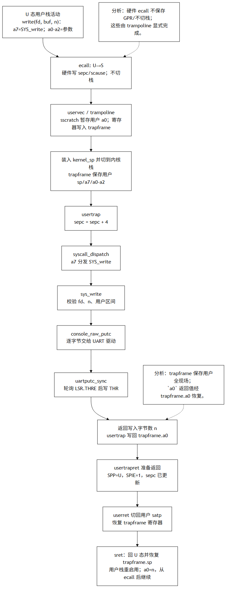
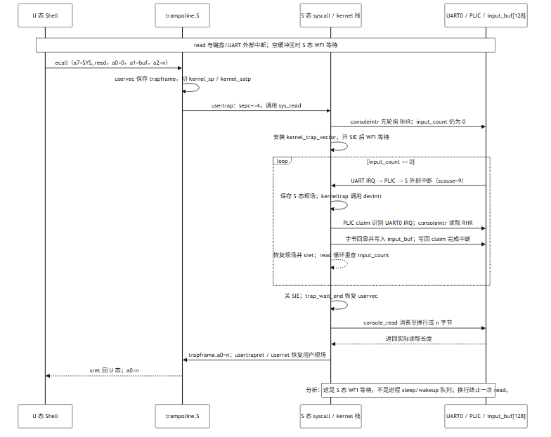
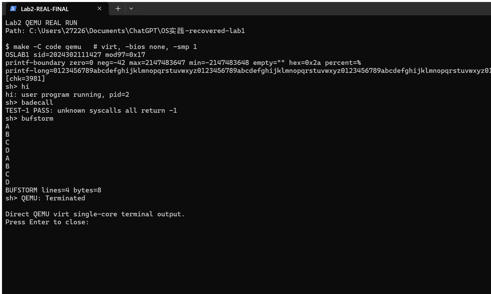

# Lab2 实验报告：陷入、中断与用户态系统调用

**基线与参数：**学号 `2024302111427`；QEMU `virt`、单核 `-smp 1`；`LAB2_TICK=3`、`LAB2_BUF_SEMANTICS=1`（字符流）、`LAB2_BUF_SIZE=128`。参数唯一来源为 [`course_sid.h`](../../../code/kernel/course_sid.h)，课程要求映射见 [`lab2-requirements.md`](../../../course-config/lab2-requirements.md)。

## 实验目标与结果

沿用课程个人基线，实现从用户态 `ecall`、trampoline 陷阱入口、系统调用分发，到 UART 输出/输入中断以及用户态返回的可运行闭环。新增最小 Sv39 用户地址空间，并从内嵌程序表加载 `sh`、`hi`、`spin` 与测试程序。当前构建及单核 QEMU 实测进入 `sh>`；`hi`、未知系统调用、字符流输入、超长输入及忙循环期间串口输入均通过下表记录的检查。

## 设计、不变式与回滚

| 部分 | 设计与不变式 |
|---|---|
| Trapframe / 返回 | `struct trapframe` 的偏移与课程赠送 `trampoline.S` 对齐：`kernel_satp/kernel_sp/kernel_trap/epc` 位于前 40 字节，通用寄存器自偏移 40 开始，`a0` 位于偏移 112。用户态入口保存完整寄存器现场，再加载 `kernel_sp` 进入内核栈；ecall 路径只将 `sepc` 前移 4，外部中断按 `sepc` 原位恢复。返回时设置 `SPP=U`、`SPIE=1`，切回用户页表并恢复 trapframe 中保存的用户 `sp`（`trapframe.sp`），再执行 `sret`。 |
| Syscall ABI | `a7` 为系统调用号，`a0–a2` 为参数，返回值写入 trapframe 的 `a0`。`argint/argaddr/argstr` 只允许读取 ABI 参数；用户地址及字符串扫描范围受 `user_range`/256 字节上限约束。未知号统一返回 `-1`，不能因坏调用号 panic。 |
| 地址空间 / exec | 当前不是 `satp=0` 的 Bare 执行。`build_pagetable()` 构造最小 Sv39 页表：用户虚拟地址 `[0, 256 KiB)` 映射到 `.userimage`，另映射内核、CLINT/UART/PLIC 窗口及高地址 `TRAPFRAME`、`TRAMPOLINE`。用户镜像仍以 0 为链接基址，并经 `_uprog_table` 嵌入；启动时检查用户镜像物理位置在 `kernel_end` 之后。用户初始栈顶为 `PROC_MEM_SIZE-16`，保持 16 字节对齐。 |
| 进程与错误回滚 | 本阶段使用单一物理活动镜像槽，不宣称已有完整进程地址空间隔离或调度器。`fork` 先把父镜像复制到 `fork_backup`、复制 trapframe 并设子进程 `a0=0`；父进程取得子 pid。失败的 `exec` 在查找/长度检查后直接返回 `-1`，不会覆写旧镜像；子进程退出时从备份恢复父镜像、标记 `ZOMBIE`，再由 `wait` 回收槽位。 |
| UART 输入 | `input_buf[128]` 由 `input_r/input_w/input_count` 管理，`consoleintr` 为生产者。字符流模式有任一字节即可读；读取仍在换行处结束。缓冲满时丢弃最旧字节，同时修正被丢弃换行的计数。空缓冲读取采用 S 态中断 + `wfi` 并在中断后重查；此处不是 Lab4 的进程 sleep/wakeup 队列。 |
| UART 输出 | 每次写 THR 前等待 LSR.THRE（bit 5），`io_fence()` 保证设备访问顺序。`sys_write` 验证 fd、长度及用户缓冲区，再逐字节经 `console_raw_putc` 输出。 |

### V2 思考题

1. **`ecall` 与 `sret` 改变什么？** `ecall` 使执行进入更高特权级并记录 `sepc/scause`、跳转 `stvec`；硬件不会自动保存所有 GPR 或替换栈。trampoline 显式保存现场并切入内核栈。`sret` 按 `SPP/SPIE` 及 `sepc` 恢复特权状态和返回 PC；本实现返回用户态前恢复 trapframe，包括原用户 `sp`。
2. **为何 syscall 要 `sepc += 4`，timer 中断不加？** `ecall` 是已完成的陷入指令，若 PC 不前移，`sret` 后会再次执行同一条 `ecall`。timer/UART 中断是异步打断，`sepc` 指向应继续执行的指令，原位恢复即可。
3. **字符流与行缓冲有什么差异？** 行缓冲必须等到换行才可读；字符流在任一字符到达后即可使读取继续。本学号采用字符流，但 `console_read` 仍遇换行就结束单次读取，因此四行输入形成四次稳定边界；本轮不会把这项策略误称为逐字节 syscall 返回。

## 代码位置

| 位置 | 内容 |
|---|---|
| [`code/kernel/trap.c`](../../../code/kernel/trap.c)、[`code/kernel/trampoline.S`](../../../code/kernel/trampoline.S)、[`code/kernel/entry.S`](../../../code/kernel/entry.S) | 用户态陷入/返回、内核等待态陷入、PLIC/UART 及定时器中断入口。课程赠送的 `trampoline.S` 保持未改。 |
| [`code/kernel/syscall.c`](../../../code/kernel/syscall.c)、[`code/kernel/proc.c`](../../../code/kernel/proc.c)、[`code/kernel/proc.h`](../../../code/kernel/proc.h) | syscall 参数、分发、`fork/exec/wait`、进程与 trapframe 数据结构、SV39 映射。 |
| [`code/kernel/console.c`](../../../code/kernel/console.c)、[`code/kernel/course_sid.h`](../../../code/kernel/course_sid.h) | UART THR 轮询、PLIC 输入缓冲、学号个性化参数。 |
| [`code/kernel/lab2.ld`](../../../code/kernel/lab2.ld)、[`code/kernel/trampoline_anchor.S`](../../../code/kernel/trampoline_anchor.S)、[`code/kernel/userimg.S`](../../../code/kernel/userimg.S) | Lab2 链接 overlay、trampoline 段锚点及内嵌用户镜像表；课程原始 `kernel.ld`、用户接口和 `user.ld` 不替换。 |
| [`code/Makefile`](../../../code/Makefile)、[`code/Makefile.upgrade`](../../../code/Makefile.upgrade) | `Makefile.upgrade` 按课程增量包原样保留；主 `Makefile` 合并其中的 Lab2 构建规则，并加入本轮用户程序与链接 overlay。 |
| [`code/user/`](../../../code/user/)、[`code/support/`](../../../code/support/) | Shell、用户测试程序与 QEMU 串口注入驱动。 |

## 实现前测试设计与实测

下面前两项作为实施前的边界/错误路径验收目标；后两项补充覆盖并发输入及正常用户程序链路。所有结果均取自真实 QEMU 和留存的驱动断言摘要，而非模拟日志。

| 用例 | 预期 | 实测结果 |
|---|---|---|
| `badecall`：连续触发 90–99 等未实现 syscall | 每次返回 `-1`，Shell 不 panic，随后重新出现 `sh>` | `TEST-1 PASS: unknown syscalls all return -1`；smoke 驱动 `EXPECT failures=0`。 |
| `bufstorm`：短输入四行，再注入每行 140 字节（超过 128 字节环形缓冲） | 四次读取有稳定换行边界；溢出按策略丢弃最旧字节，内核不死锁并回到 Shell | 短行输出 `BUFSTORM lines=4 bytes=8`；超长输入输出 `BUFSTORM lines=4 bytes=397`，后续残片被 Shell 拒绝为命令，但 `sh>` 仍响应。两驱动 EXPECT 均为 0 失败。 |
| `spin` 运行期间注入 `ping` | 忙循环中接收并回显 UART 输入，不破坏内核 | 输出在 `spin 184` 与 `spin 185` 之间出现 `ping`；驱动 EXPECT 全通过。 |
| `hi` / 重复 `hi` | 覆盖 `fork → exec → write → exit → wait` 与子 pid 返回 | 实测输出 `hi: user program running, pid=2`，Shell 返回 `sh>`。 |

仓库留存的设计笔记首次与实现一起进入提交历史，未保留独立且不可变的“编写早于代码”快照。因此本节如实列出实施前应采用的两个验收目标及最终实测，不单凭当前文档声称其时间先后已经由 Git 独立证明。

## 构建、回归与查验命令

从仓库根目录运行：

```bash
make -C code clean && make -C code -j2
python3 -m unittest discover -s code/tests -p "test_*.py" -v
python3 code/check_expect.py 2024302111427 code/expect_banner.txt
python3 code/tests/verify_lab1_qemu.py
python3 code/support/inject_uart.py --tree code --script code/support/lab2-smoke.script
python3 code/support/inject_uart.py --tree code --script code/support/lab2-bufstorm.script
python3 code/support/inject_uart.py --tree code --script code/support/lab2-overflow.script
python3 code/support/inject_uart.py --tree code --script code/support/lab2-spin.script
```

本轮最终复核记录：构建成功；全量 `unittest` 共 13 项，全部通过；banner 校验成功；Lab1 QEMU 两次冷启动均匹配 294 字节 banner。四个 Lab2 串口驱动的 EXPECT 失败数均为 0。基础验收为 QEMU `virt`、单核 `-smp 1`。

最终链接检查使用 `readelf -SW/-lW`：`.trampsec` 为 RX 段，起始 `0x800cf000`；trampoline 入口按页对齐；`.userimage` 为独立的 NOLOAD/RW 段，起始 `0x800d0000`。课程原始 `kernel.ld` 未改，Lab2 使用新增链接 overlay。构建时唯一 warning 是既有内核 LOAD 段的 RWX 权限提示。

一段真实 QEMU Shell 输出摘录：

```text
OSLAB1 sid=2024302111427 mod97=0x17
[chk=3981]
sh> hi
hi: user program running, pid=2
sh> badecall
TEST-1 PASS: unknown syscalls all return -1
sh> bufstorm
BUFSTORM lines=4 bytes=8
sh>
```

`-d int` 实际日志切片中有 `desc=m_timer`、`desc=s_external`、`desc=user_ecall`；已检查的切片未见非法指令或取指故障。真实中断摘要：

```text
cause=0000000000000007 ... desc=m_timer
cause=0000000000000009 ... desc=s_external
cause=0000000000000008 ... desc=user_ecall
```

## 图示与真实运行证据

**`write` 系统调用及 trapframe / 栈流：**



**空缓冲读取、UART 外部中断及环形缓冲处理：**



两张图的可编辑源文件分别是 [`lab2-trap-flow.mmd`](../images/lab2-trap-flow.mmd) 和 [`lab2-console-sequence.mmd`](../images/lab2-console-sequence.mmd)。PNG 由 Mermaid CLI 实际渲染，并逐一检查箭头方向、标签、文本裁切与黑白版式。时序图明确展示 S 态 WFI/中断后重查，而非虚构进程调度器唤醒。

**QEMU `virt` 单核真实终端运行截图**（包含 banner、`hi`、`badecall` 与短行 `bufstorm`；超长输入以驱动输出摘要为准）：



## Git 与归档

GitHub 仓库为 [`hoyuand/2024302111427`](https://github.com/hoyuand/2024302111427)，克隆/推送地址为 `https://github.com/hoyuand/2024302111427.git`。Lab2 最终提交创建并校正了 `lab2`、`lab2-submit` 标签，同时保留 `lab2-start` 作为实现起点；归档完成后 `main`、`lab2`、`lab2-submit` 同步指向本轮最终提交。提交归档名为 `提交-lab2-2024302111427.zip`，代码增量包为相对 `lab1-submit` 的 `code/archives/lab2-code-delta-2024302111427.zip`；二者均为本地提交包，不纳入源码仓库。远端分支与标签通过 `git ls-remote` 核对，具体对象以仓库 Git 历史为准。

## 边界与后续

当前实现未声称具备完整调度器、真正的进程 sleep/wakeup、独立地址空间隔离、磁盘文件系统或 `argv` 深拷贝；相应内容留给后续 Lab。最小 Sv39 映射仅服务本轮用户镜像、内核、设备窗口、trapframe 与 trampoline。超 128 字节输入测试证明缓冲溢出后内核存活及 Shell 可继续响应，不把它夸大为保留了整条超长命令。
