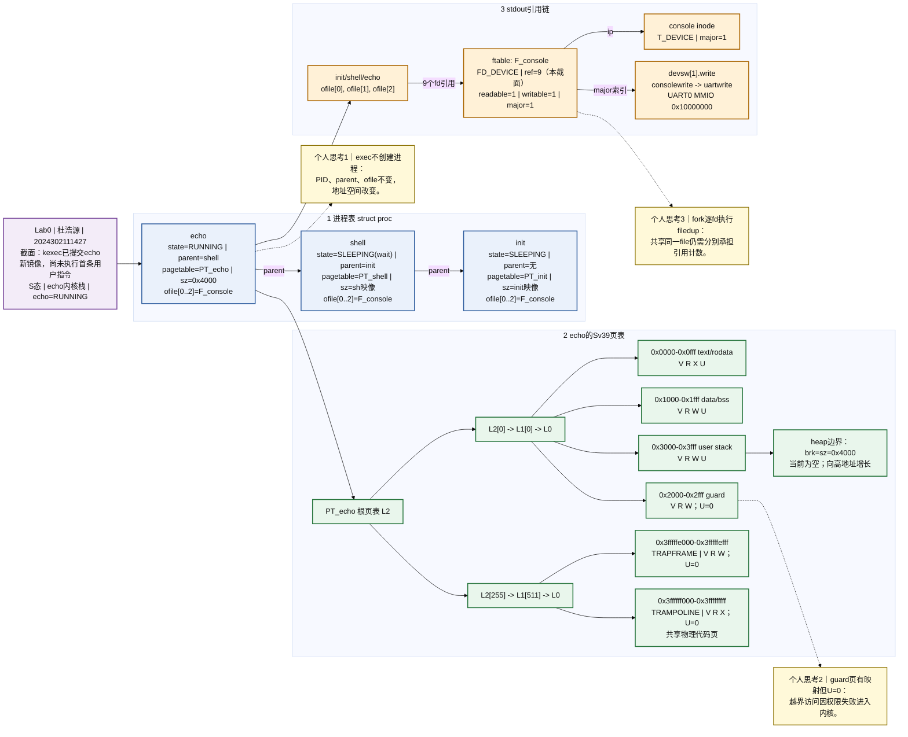

# exec 完成时的核心数据结构快照

绘制工具：Mermaid。可编辑源文件为同名 `.mmd`，提交图为同名 `.svg` 和 `.png`。

```mermaid
%%{init: {"theme":"base","themeVariables":{"fontSize":"17px","fontFamily":"Microsoft YaHei, Arial, sans-serif"},"flowchart":{"nodeSpacing":28,"rankSpacing":38,"curve":"basis"}}}%%
flowchart LR
  classDef proc fill:#eaf1fb,stroke:#315f9f,color:#111,stroke-width:2px
  classDef page fill:#e9f6ec,stroke:#24733a,color:#111,stroke-width:2px
  classDef file fill:#fff1d7,stroke:#aa6500,color:#111,stroke-width:2px
  classDef note fill:#fff9d9,stroke:#8a7000,color:#111,stroke-width:1.5px
  classDef root fill:#f3ecf8,stroke:#77459a,color:#111,stroke-width:2px

  moment["Lab0 | 杜浩源 | 2024302111427<br/>截面：kexec已提交echo新镜像，尚未执行首条用户指令<br/>S态 | echo内核栈 | echo=RUNNING"]:::root

  subgraph PROCS[1 进程表 struct proc]
    direction TB
    init["init<br/>state=SLEEPING | parent=无<br/>pagetable=PT_init | sz=init映像<br/>ofile[0..2]=F_console"]:::proc
    shell["shell<br/>state=SLEEPING(wait) | parent=init<br/>pagetable=PT_shell | sz=sh映像<br/>ofile[0..2]=F_console"]:::proc
    echo["echo<br/>state=RUNNING | parent=shell<br/>pagetable=PT_echo | sz=0x4000<br/>ofile[0..2]=F_console"]:::proc
    echo -->|parent| shell -->|parent| init
  end

  subgraph SV39[2 echo的Sv39页表]
    direction TB
    pt["PT_echo 根页表 L2"]:::page
    low["L2[0] -> L1[0] -> L0"]:::page
    p0["0x0000-0x0fff text/rodata<br/>V R X U"]:::page
    p1["0x1000-0x1fff data/bss<br/>V R W U"]:::page
    p2["0x2000-0x2fff guard<br/>V R W；U=0"]:::page
    p3["0x3000-0x3fff user stack<br/>V R W U"]:::page
    heap["heap边界：brk=sz=0x4000<br/>当前为空；向高地址增长"]:::page
    high["L2[255] -> L1[511] -> L0"]:::page
    tf["0x3fffffe000-0x3fffffefff<br/>TRAPFRAME | V R W；U=0"]:::page
    tr["0x3ffffff000-0x3fffffffff<br/>TRAMPOLINE | V R X；U=0<br/>共享物理代码页"]:::page

    pt --> low
    low --> p0
    low --> p1
    low --> p2
    low --> p3 --> heap
    pt --> high
    high --> tf
    high --> tr
  end

  subgraph FILES[3 stdout引用链]
    direction TB
    ofs["init/shell/echo<br/>ofile[0], ofile[1], ofile[2]"]:::file
    fc["ftable: F_console<br/>FD_DEVICE | ref=9（本截面）<br/>readable=1 | writable=1 | major=1"]:::file
    ino["console inode<br/>T_DEVICE | major=1"]:::file
    dev["devsw[1].write<br/>consolewrite -> uartwrite<br/>UART0 MMIO 0x10000000"]:::file
    ofs -->|9个fd引用| fc -->|ip| ino
    fc -->|major索引| dev
  end

  moment --> echo
  echo --> pt
  echo --> ofs

  n1["个人思考1｜exec不创建进程：<br/>PID、parent、ofile不变，地址空间改变。"]:::note
  n2["个人思考2｜guard页有映射但U=0：<br/>越界访问因权限失败进入内核。"]:::note
  n3["个人思考3｜fork逐fd执行filedup：<br/>共享同一file仍需分别承担引用计数。"]:::note
  echo -.-> n1
  p2 -.-> n2
  fc -.-> n3
```
