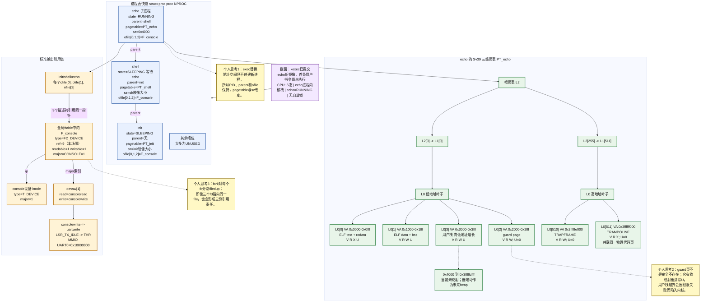

# exec 完成时的核心数据结构快照

数字参考图，用于核对本人手绘内容。

```mermaid
%%{init: {"theme":"base","themeVariables":{"fontSize":"19px","fontFamily":"Microsoft YaHei, Arial, sans-serif"},"flowchart":{"nodeSpacing":40,"rankSpacing":50}}}%%
flowchart TB
  classDef proc fill:#e8f0fe,stroke:#2f5da8,color:#111,stroke-width:2px
  classDef page fill:#e8f5e9,stroke:#287d3c,color:#111,stroke-width:2px
  classDef file fill:#fff3d6,stroke:#b56b00,color:#111,stroke-width:2px
  classDef note fill:#fff8c5,stroke:#8a6d00,color:#111,stroke-width:2px
  classDef root fill:#f3e8ff,stroke:#7b3fa1,color:#111,stroke-width:2px

  moment["截面：kexec已提交echo新镜像，首条用户指令尚未执行<br/>CPU: S态 | echo进程内核栈 | echo=RUNNING | 无自旋锁"]:::root

  subgraph PROCS[进程表快照 struct proc proc NPROC]
    direction LR
    init["init<br/>state=SLEEPING<br/>parent=无<br/>pagetable=PT_init<br/>sz=init映像大小<br/>ofile[0,1,2]=F_console"]:::proc
    shell["shell<br/>state=SLEEPING 等待echo<br/>parent=init<br/>pagetable=PT_shell<br/>sz=sh映像大小<br/>ofile[0,1,2]=F_console"]:::proc
    echo["echo 子进程<br/>state=RUNNING<br/>parent=shell<br/>pagetable=PT_echo<br/>sz=0x4000<br/>ofile[0,1,2]=F_console"]:::proc
    unused["其余槽位<br/>大多为UNUSED"]:::proc
    echo -->|"parent"| shell -->|"parent"| init
  end

  subgraph SV39[echo 的 Sv39 三级页表 PT_echo]
    direction TB
    rootpt["根页表 L2"]:::page
    lowl1["L2[0] -> L1[0]"]:::page
    lowl0["L0 低地址叶子"]:::page
    text["L0[0] VA 0x0000-0x0fff<br/>ELF text + rodata<br/>V R X U"]:::page
    data["L0[1] VA 0x1000-0x1fff<br/>ELF data + bss<br/>V R W U"]:::page
    guard["L0[2] VA 0x2000-0x2fff<br/>guard page<br/>V R W; U=0"]:::page
    stack["L0[3] VA 0x3000-0x3fff<br/>用户栈 向低地址增长<br/>V R W U"]:::page
    gap["0x4000 到 0x3fffffdfff<br/>当前未映射；低端可作为未来heap"]:::page
    highl1["L2[255] -> L1[511]"]:::page
    highl0["L0 高地址叶子"]:::page
    trapframe["L0[510] VA 0x3fffffe000<br/>TRAPFRAME<br/>V R W; U=0"]:::page
    trampoline["L0[511] VA 0x3ffffff000<br/>TRAMPOLINE<br/>V R X; U=0<br/>共享同一物理代码页"]:::page
    rootpt --> lowl1 --> lowl0
    lowl0 --> text
    lowl0 --> data
    lowl0 --> guard
    lowl0 --> stack
    stack -.-> gap
    rootpt --> highl1 --> highl0
    highl0 --> trapframe
    highl0 --> trampoline
  end

  subgraph FILES[标准输出引用链]
    direction LR
    ofiles["init/shell/echo<br/>每个ofile[0], ofile[1], ofile[2]"]:::file
    fconsole["全局ftable中的 F_console<br/>type=FD_DEVICE<br/>ref=9（本场景）<br/>readable=1 writable=1<br/>major=CONSOLE=1"]:::file
    inode["console设备 inode<br/>type=T_DEVICE<br/>major=1"]:::file
    devsw["devsw[1]<br/>read=consoleread<br/>write=consolewrite"]:::file
    uart["consolewrite -> uartwrite<br/>LSR_TX_IDLE -> THR<br/>MMIO UART0=0x10000000"]:::file
    ofiles -->|"9个描述符引用同一指针"| fconsole -->|"ip"| inode
    fconsole -->|"major索引"| devsw --> uart
  end

  moment --> PROCS
  echo --> rootpt
  echo --> ofiles

  thought1["个人思考1：exec替换地址空间但不创建新进程，<br/>所以PID、parent和ofile保持，pagetable与sz改变。"]:::note
  thought2["个人思考2：guard页不是完全不存在；它有效映射但清除U，<br/>用户栈越界会因权限失败而陷入内核。"]:::note
  thought3["个人思考3：fork对每个fd分别filedup；<br/>即使三个fd指向同一file，也会形成三份引用责任。"]:::note
  echo -.-> thought1
  guard -.-> thought2
  fconsole -.-> thought3
```

