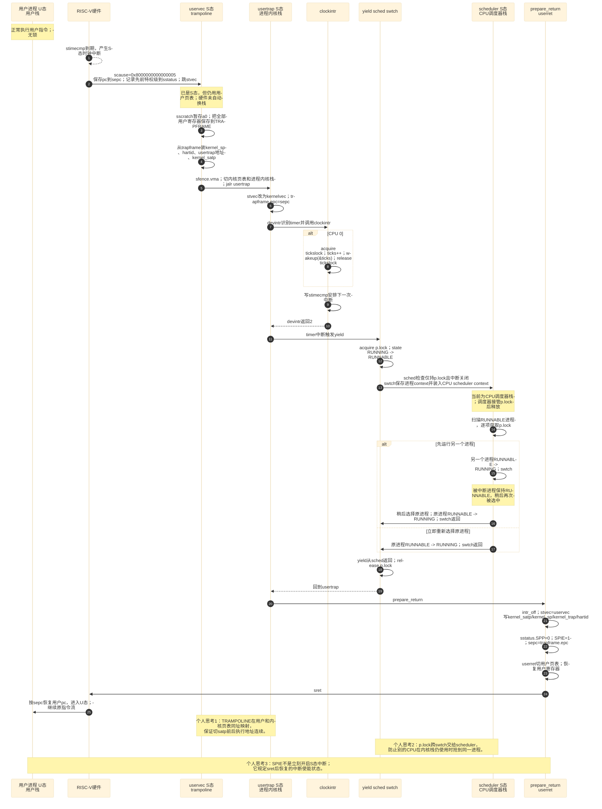

# 时钟中断的微观旅程

数字参考图，用于核对本人手绘内容。

```mermaid
%%{init: {"theme":"base","themeVariables":{"fontSize":"18px","fontFamily":"Microsoft YaHei, Arial, sans-serif"},"sequence":{"wrap":true,"diagramMarginX":40,"actorMargin":35,"messageMargin":35}}}%%
sequenceDiagram
  autonumber
  participant U as 用户进程 U态 用户栈
  participant H as RISC-V硬件
  participant V as uservec S态 trampoline
  participant T as usertrap S态 进程内核栈
  participant C as clockintr
  participant P as yield sched swtch
  participant S as scheduler S态 CPU调度器栈
  participant R as prepare_return userret

  Note over U: 正常执行用户指令；无锁
  H-->>H: stimecmp到期，产生S态时钟中断
  H->>V: scause=0x8000000000000005<br/>保存pc到sepc；记录先前特权级到sstatus；跳stvec
  Note over V: 已是S态，但仍用用户页表；硬件未自动换栈
  V->>V: sscratch暂存a0；把全部用户寄存器保存到TRAPFRAME
  V->>V: 从trapframe装kernel_sp、hartid、usertrap地址、kernel_satp
  V->>T: sfence.vma；切内核页表和进程内核栈；jalr usertrap
  T->>T: stvec改为kernelvec；trapframe.epc=sepc
  T->>C: devintr识别timer并调用clockintr
  alt CPU 0
    C->>C: acquire tickslock；ticks++；wakeup(&ticks)；release tickslock
  end
  C->>C: 写stimecmp安排下一次中断
  C-->>T: devintr返回2
  T->>P: timer中断触发yield
  P->>P: acquire p.lock；state RUNNING -> RUNNABLE
  P->>S: sched检查仅持p.lock且中断关闭<br/>swtch保存进程context并装入CPU scheduler context
  Note over S: 当前为CPU调度器栈；调度器接管p.lock后释放
  S->>S: 扫描RUNNABLE进程，逐项获取p.lock
  alt 先运行另一个进程
    S->>S: 另一个进程RUNNABLE -> RUNNING；swtch
    Note over S: 被中断进程保持RUNNABLE，稍后再次被选中
    S->>P: 稍后选择原进程；原进程RUNNABLE -> RUNNING；swtch返回
  else 立即重新选择原进程
    S->>P: 原进程RUNNABLE -> RUNNING；swtch返回
  end
  P->>P: yield从sched返回；release p.lock
  P-->>T: 回到usertrap
  T->>R: prepare_return
  R->>R: intr_off；stvec=uservec<br/>写kernel_satp/kernel_sp/kernel_trap/hartid
  R->>R: sstatus.SPP=0；SPIE=1；sepc=trapframe.epc
  R->>R: userret切用户页表；恢复用户寄存器
  R->>H: sret
  H->>U: 按sepc恢复用户pc，进入U态；继续原指令流

  Note over V,T: 个人思考1：TRAMPOLINE在用户和内核页表同址映射，<br/>保证切satp前后执行地址连续。
  Note over P,S: 个人思考2：p.lock跨swtch交给scheduler，<br/>防止别的CPU在内核栈仍使用时抢到同一进程。
  Note over R,U: 个人思考3：SPIE不是立刻开启S态中断；<br/>它规定sret后恢复的中断使能状态。
```

