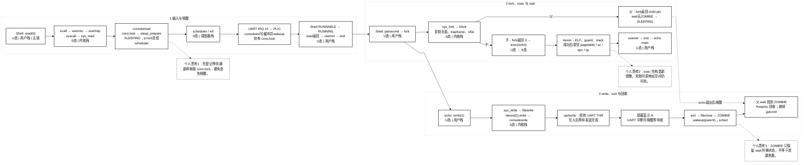

# echo hi 全系统控制流

黑白流程图；可编辑源文件为同名 `.mmd`，提交图为同名 `.svg` 和 `.png`。

```mermaid
%%{init: {"theme":"base","themeVariables":{"fontFamily":"Arial, Microsoft YaHei, sans-serif","primaryColor":"#ffffff","primaryTextColor":"#000000","primaryBorderColor":"#000000","lineColor":"#000000","secondaryColor":"#ffffff","tertiaryColor":"#ffffff"},"flowchart":{"nodeSpacing":28,"rankSpacing":42,"curve":"linear"}}}%%
flowchart LR
  classDef plain fill:#ffffff,stroke:#000000,color:#000000,stroke-width:1.5px
  classDef note fill:#ffffff,stroke:#000000,color:#000000,stroke-width:1px,stroke-dasharray:4 3

  subgraph INPUT[1 输入与唤醒]
    direction TB
    i1["Shell: read(0)\nU态 | 用户栈 | 无锁"]:::plain
    i2["ecall → uservec → usertrap\nsyscall → sys_read\nS态 | 内核栈"]:::plain
    i3["consoleread\ncons.lock → sleep_prepare\nSLEEPING；p.lock交给scheduler"]:::plain
    i4["scheduler / wfi\nS态 | 调度器栈"]:::plain
    i5["UART IRQ 10 → PLIC\nconsoleintr写缓冲并wakeup\n持有 cons.lock"]:::plain
    i6["Shell RUNNABLE → RUNNING\nread返回 → userret → sret\nU态 | 用户栈"]:::plain
    i1 --> i2 --> i3 --> i4 --> i5 --> i6
  end

  subgraph CREATE[2 fork、exec 与 wait]
    direction TB
    f1["Shell: parsecmd → fork\nU态 | 用户栈"]:::plain
    f2["sys_fork → kfork\n复制页表、trapframe、ofile\nS态 | 内核栈"]:::plain
    f3["父：fork返回 child pid\nwait无ZOMBIE → SLEEPING"]:::plain
    f4["子：fork返回 0 → exec(echo)\nU态 → S态"]:::plain
    f5["kexec：ELF、guard、stack\n成功后提交 pagetable / sz / epc / sp"]:::plain
    f6["userret → sret → echo main\nU态 | 用户栈"]:::plain
    f1 --> f2
    f2 -->|父| f3
    f2 -->|子| f4 --> f5 --> f6
  end

  subgraph OUTPUT[3 write、exit 与回收]
    direction TB
    o1["echo: write(1)\nU态 | 用户栈"]:::plain
    o2["sys_write → filewrite\ndevsw[1].write → consolewrite\nS态 | 内核栈"]:::plain
    o3["uartwrite：轮询 UART THR\n写入后等待发送完成"]:::plain
    o4["屏幕显示 hi\nUART 中断可唤醒等待者"]:::plain
    o5["exit → fileclose → ZOMBIE\nwakeup(parent)；sched"]:::plain
    o6["父 wait 找到 ZOMBIE\nfreeproc 回收；继续 getcmd"]:::plain
    o1 --> o2 --> o3 --> o4 --> o5 --> o6
  end

  i6 --> f1 --> o1
  f3 -.->|echo退出后唤醒| o6
  n1["个人思考1：先登记等待通道再释放 cons.lock，避免丢失唤醒。"]:::note
  n2["个人思考2：exec 先构造新镜像，失败时原地址空间仍可用。"]:::note
  n3["个人思考3：ZOMBIE 只保留 wait 所需状态，不等于资源泄漏。"]:::note
  i3 -.-> n1
  f5 -.-> n2
  o5 -.-> n3
```
